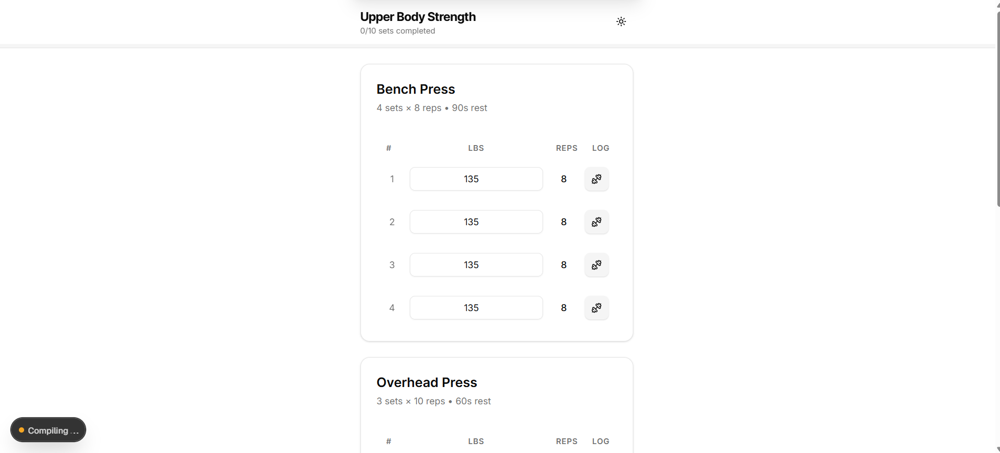

🏋️‍♂️ FitTrack Pro

A modern, mobile-first workout logger built with Next.js 16+, TypeScript, and Tailwind CSS. Designed to work completely offline as a Progressive Web App (PWA).

✨ Features

    📋 Workout Logging: Track sets, reps, and actual weight lifted.

    ⏱️ Smart Rest Timer: Automatically starts a countdown when you mark a set as complete. Plays audio and vibrates on finish.

    💾 Local Storage Persistence: Never lose your progress. Data survives page refreshes.

    📱 PWA & Offline Support: Installable on iOS (iPhone) and Android. Works without internet.

    🌗 Dark/Light Mode: Fully themable UI using Shadcn/UI and Tailwind.

    🎉 Visual Feedback: Confetti celebrations and smooth Framer Motion animations.

    🍏 iOS Optimized: Custom instructions for installing on iPhones.

🛠️ Tech Stack

    Framework: Next.js 16 (App Router)

    Language: TypeScript

    Styling: Tailwind CSS

    Components: Shadcn UI

    Animations: Framer Motion

    PWA: @ducanh2912/next-pwa

    State Management: React Hooks + usehooks-ts (localStorage)

🚀 Getting Started
Prerequisites

    Node.js 18+ installed

    pnpm installed (Recommended)

Installation

    Clone the repository:
    code Bash

    
git clone https://github.com/Henok-Aragaw/workout_challenge.git
cd workout_challenge

  

Install dependencies:
code Bash

    
pnpm install

  

Run the development server:

    Note: We use the --webpack flag because PWA plugins currently conflict with Next.js Turbopack.

code Bash

        
    pnpm dev

      

    Open http://localhost:3000 in your browser.

📱 PWA Setup (Important)

For the "Install App" button to appear, specific requirements must be met.
1. Folder Structure

Ensure your public folder contains the icons:
code Text

    
/public
  /icons
    ├── icon-192x192.png
    └── icon-512x512.png
  manifest.json

  

2. Manifest Configuration

Ensure public/manifest.json uses "purpose": "any maskable" to avoid browser warnings.
3. Build & Deploy

To test the PWA fully (service workers, offline mode), build for production:
code Bash

    
# Build using Webpack (Required for PWA)
pnpm build

# Start production server
pnpm start

  

⚠️ Common Issues & Fixes
1. "This build is using Turbopack... with a webpack config"

Cause: Next.js 16+ uses Turbopack by default, but the PWA plugin requires Webpack.
Fix: Always add --webpack to your scripts in package.json:
code JSON

    
"scripts": {
  "dev": "next dev --webpack",
  "build": "next build --webpack"
}

  

2. Install Button Not Showing

Cause: Browser has cached an old version of the manifest or icons are missing.
Fix:

    Open DevTools (F12) -> Application -> Storage.

    Click Clear site data.

    Hard refresh (Ctrl+F5).

3. iOS Installation

iOS does not support the native "Install Prompt" button. This app includes a custom modal that detects iOS devices and instructs the user to tap Share -> Add to Home Screen.
📂 Project Structure
code Text

    
/app
  /components
    /ui             # Shadcn reusable components
    install-prompt  # PWA Install logic
    exercise-card   # Main workout UI
    rest-timer      # Countdown logic
  /hooks
    use-workout.ts  # State management & LocalStorage logic
  /lib
    data.ts         # Sample workout data
    types.ts        # TypeScript interfaces
  layout.tsx        # Metadata & Viewport settings
  page.tsx          # Main entry point
/public
  /icons          # PWA Icons
  manifest.json   # PWA Manifest

  

🤝 Contributing

Contributions are welcome! Please feel free to submit a Pull Request.